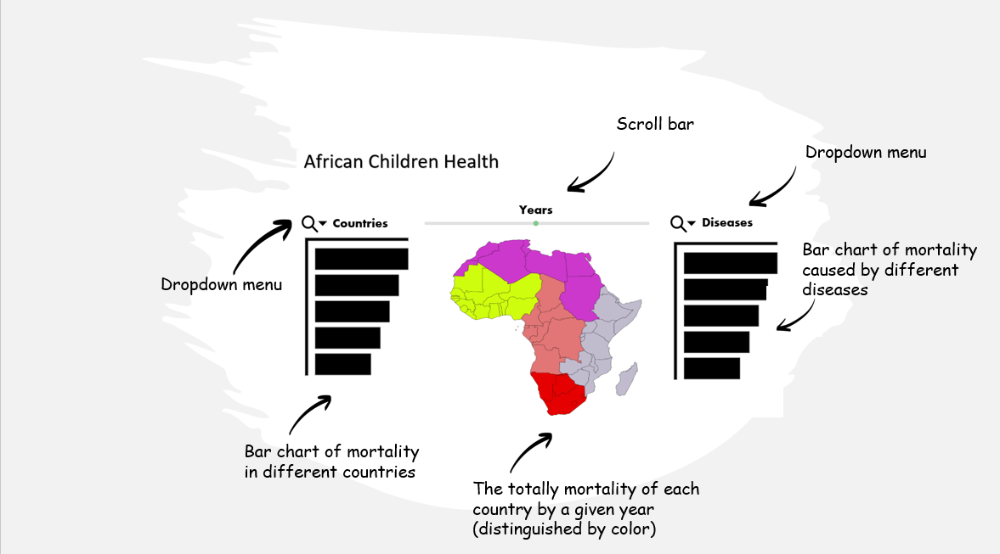

# dsci_532_group_24

## Description of app & sketch

While working with rich Gapminder datasets will help us provide a wealth of information to our app users, we may end up with over-plotting and clutter in data visualization if we are not careful. We aim to reduce visual clutter as much as possible by providing an intuitive user interface and simple visualization layout.

There will be a horizontal interface at the top of the page consisting of (1) drop-down menu with checkboxes where users can select multiple countries, (2) slider to view the shift in data across different years, and (3) drop-down menu where users can select different diseases. 

The visual components include the map of African continent at the centre and two sorted bar plots, one on each side of the map. The map will serve 2 purposes: (1) it provides the geographical information to the user, who may be interested in the proximity of different countries to each other (e.g. shipping medical supplies to multiple countries), and (2) it provides a heat map for child mortality.
 
To the left of the map, there will be a bar chart displaying the total child mortality for each country, accounting for all diseases selected by the user, ranked in the descending order; similarly, to the right of the map, there will be a bar chart displaying the total child mortality for each disease, accounting for all countries selected by the user, ranked in the descending order. 

The interactive and visual components of the app are entangled with each other in a way that is most intuitive to help user experience. Changing any of the three interactive components (e.g. unselecting a disease) will affect all three of the visual components. However, users will still find it easy to find a specific interactive component, since the location of the interactive component will be closest to the visual component it affects the most. For instance, drop-down menu for the countries will be located just above the bar chart that ranks the countries with the highest mortality; slider for the year will be located just above the map, since changing the years using the slider will likely have the highest impact on the color encoding displayed on the map.

